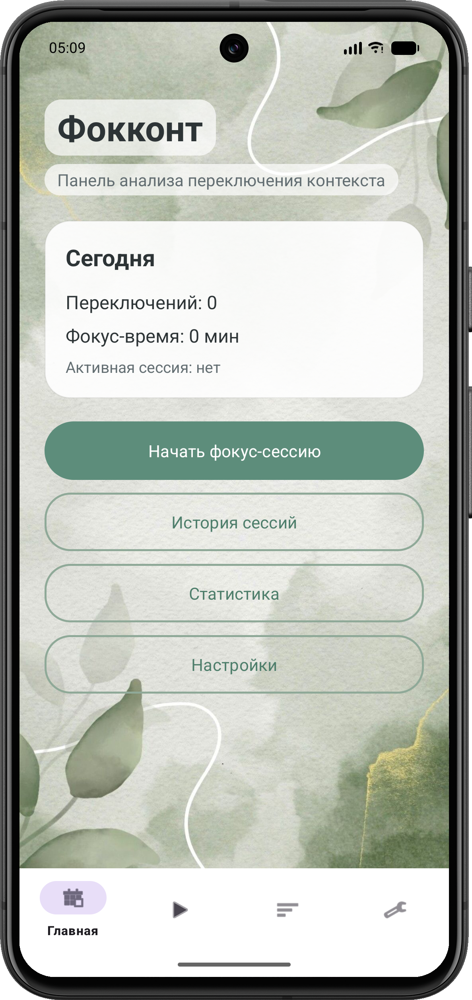
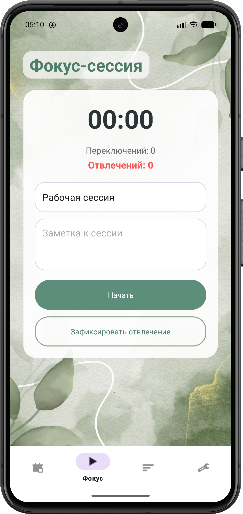
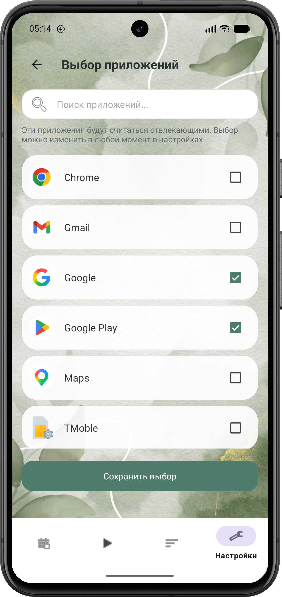
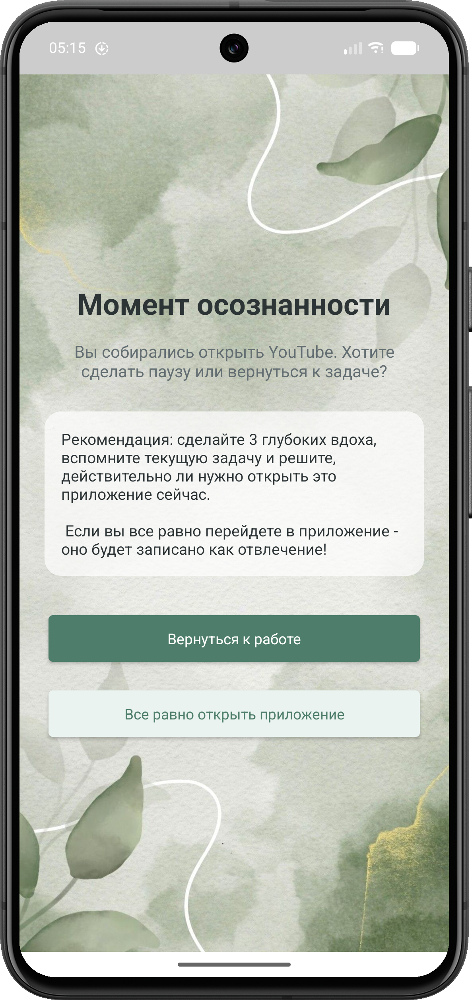
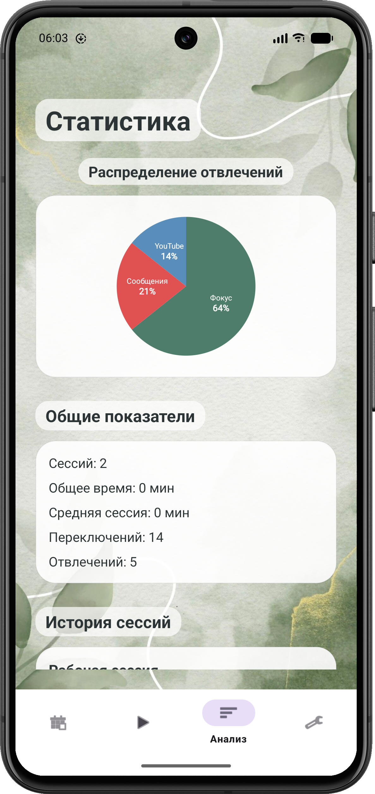
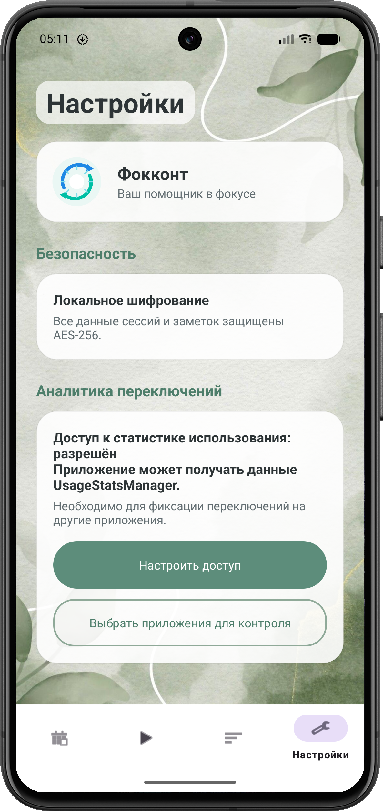
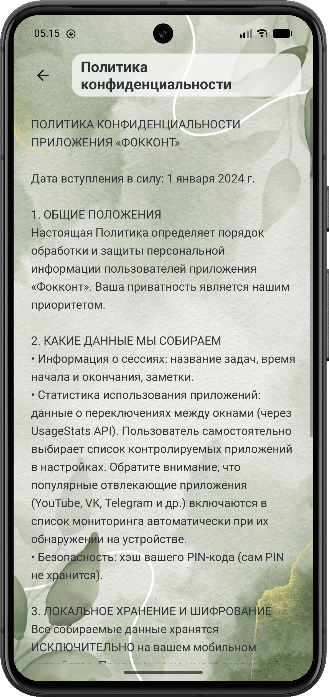

<p align="center">
  
</p>

<h1 align="center">🌿 Фокконт</h1>

<p align="center">
Мягкое снижение цифровых отвлечений при работе
</p>

<p align="center">
  <a href="https://github.com/CatherineFlower/Fokcont/releases/tag/v1.0-beta">
    
  </a>
  <a href="https://disk.yandex.ru/d/ewn2ce2uqNVSGA">
    
  </a>
  <a href="https://github.com/CatherineFlower/Fokcont">
    
  </a>
</p>

---

## О проекте

**Фокконт** — мобильное приложение для Android, разработанное на языке Kotlin и предназначенное для снижения цифровых отвлечений во время работы, учёбы и выполнения задач, требующих концентрации внимания.

В отличие от классических блокировщиков приложений, Фокконт не запрещает пользователю открывать социальные сети, видеохостинги и другие отвлекающие сервисы. Вместо этого приложение использует подход мягкого поведенческого вмешательства: в момент запуска отвлекающего приложения пользователь получает дополнительную точку принятия решения, которая помогает осознать факт отвлечения и вернуться к текущей задаче.

Основная цель проекта — не ограничение пользователя, а развитие навыков саморегуляции и осознанного использования цифровых устройств.

---

## Дипломный проект Samsung Academy

Проект выполнен в рамках программы дополнительного профессионального образования:

**«Мобильная разработка на Kotlin»**

при поддержке **Samsung Academy**.

---

## Команда проекта

### Участники

**Павлов Артём**
ДПО «Мобильная разработка на Kotlin»
Москва, РТУ МИРЭА

**Петренко Екатерина**
ДПО «Мобильная разработка на Kotlin»
Москва, РТУ МИРЭА

### Руководитель проекта

**Степанов Павел**

---

## Контакты

| Участник           | Telegram  |
| ------------------ | --------- |
| Екатерина Петренко | @cath_776 |
| Артём Павлов       | @inventes |

---

# 🎬 Демонстрация работы

<p align="center">
  <a href="https://github.com/CatherineFlower/Fokcont/releases/tag/v1.0-beta">
    
  </a>
</p>

<p align="center">
  <a href="https://github.com/CatherineFlower/Fokcont/releases/tag/v1.0-beta">
    
  </a>
</p>

---

# Возможности приложения

## Главный экран

На главном экране пользователь может:

* начать новую фокус-сессию;
* перейти к статистике;
* открыть настройки приложения;
* просмотреть текущую информацию о работе приложения.

### Главный экран

<p align="center">
  
</p>

---

## Фокус-сессии

* запуск рабочих сессий;
* таймер концентрации в реальном времени;
* сохранение названия задачи;
* ведение заметок;
* автоматическое сохранение статистики.

### Экран фокус-сессии

<p align="center">
  
</p>

---

## Отслеживание активности

Во время активной сессии приложение запускает фоновый сервис и отслеживает запуск сторонних приложений посредством UsageStatsManager.

Фиксируются:

* переключения между приложениями;
* подтверждённые отвлечения;
* время концентрации;
* история активности пользователя.

---

## Настройка отвлекающих приложений

Пользователь самостоятельно определяет список приложений, которые считаются отвлекающими.

Это позволяет адаптировать систему под индивидуальные привычки и сценарии использования смартфона.

### Выбор приложений

<p align="center">
  
</p>

---

## Экран осознанности

При попытке открыть приложение из списка отвлекающих поверх него отображается специальный интерфейс осознанности.

Пользователь может:

* вернуться к работе;
* всё равно открыть приложение.

Если пользователь решает продолжить использование отвлекающего приложения, событие фиксируется в статистике как подтверждённое отвлечение.

### Overlay-интерфейс

<p align="center">
  
</p>

---

## Аналитика

Приложение автоматически формирует статистику по всем проведённым сессиям.

Отображаются:

* количество сессий;
* суммарное время концентрации;
* средняя длительность сессии;
* количество переключений;
* количество отвлечений;
* распределение отвлечений по приложениям;
* история завершённых сессий.

### Экран статистики

<p align="center">
  
</p>

---

## Настройки приложения

Пользователь может:

* управлять разрешениями;
* очищать данные;
* сбрасывать настройки;
* удалять локальную информацию приложения.

### Настройки

<p align="center">
  
</p>

---

# Архитектура проекта

Проект реализован по архитектурному шаблону **MVVM (Model–View–ViewModel)**.

```text
UI (Fragments)
      ↓
ViewModel
      ↓
Repository
      ↓
Room Database
```

Структура проекта:

```text
data/
 ├── db
 ├── dao
 ├── entity

repository/
 ├── SessionRepository
 ├── UserRepository
 └── NoteRepository

viewmodel/
 ├── SessionViewModel
 ├── StatsViewModel
 └── SettingsViewModel

service/
 ├── TrackingService
 └── InterruptionOverlayService

ui/
 ├── session
 ├── stats
 ├── settings
 └── apps
```

---

# Используемые технологии

### Язык программирования

* Kotlin

### Архитектура

* MVVM
* Repository Pattern

### Хранение данных

* Room Database
* SQLite

### Android-компоненты

* Fragments
* ViewModel
* Navigation Component
* Foreground Service
* View Binding

### Системные сервисы

* UsageStatsManager
* Overlay Window (SYSTEM_ALERT_WINDOW)

### Интерфейс

* Material Design 3

---

# Конфиденциальность

Фокконт не использует внешние серверы для хранения пользовательских данных.

Все данные сохраняются локально на устройстве пользователя:

* фокус-сессии;
* заметки;
* история активности;
* события отвлечений;
* настройки приложения.

Также прописаны Пользовательское соглашение для обработки данных в принципе и Политика конфиденциальности.

### Соглашения

<p align="center">
  
</p>

---

# Необходимые разрешения

Для работы приложения требуется предоставить:

### Usage Access

Доступ к статистике использования приложений.

### Display Over Other Apps

Разрешение на отображение интерфейса поверх других приложений.

Без этих разрешений приложение не сможет отслеживать запуск сторонних приложений и показывать экран осознанности.

---

# Сборка проекта

Клонирование репозитория:

```bash
git clone https://github.com/CatherineFlower/Fokcont.git
```

Переход в каталог проекта:

```bash
cd Fokcont
```

Сборка проекта:

```bash
./gradlew assembleDebug
```

После установки необходимо предоставить приложению все требуемые разрешения.

---

<h1 align="center">📂 Материалы проекта</h1>

<p align="center">
  <a href="https://github.com/CatherineFlower/Fokcont/releases/tag/v1.0-beta">
    
  </a>
  <a href="https://disk.yandex.ru/d/ewn2ce2uqNVSGA">
    
  </a>
  <a href="https://github.com/CatherineFlower/Fokcont">
    
  </a>
</p>

---

Разработано в рамках программы
**Samsung Academy — «Мобильная разработка на Kotlin»**

2025–2026
